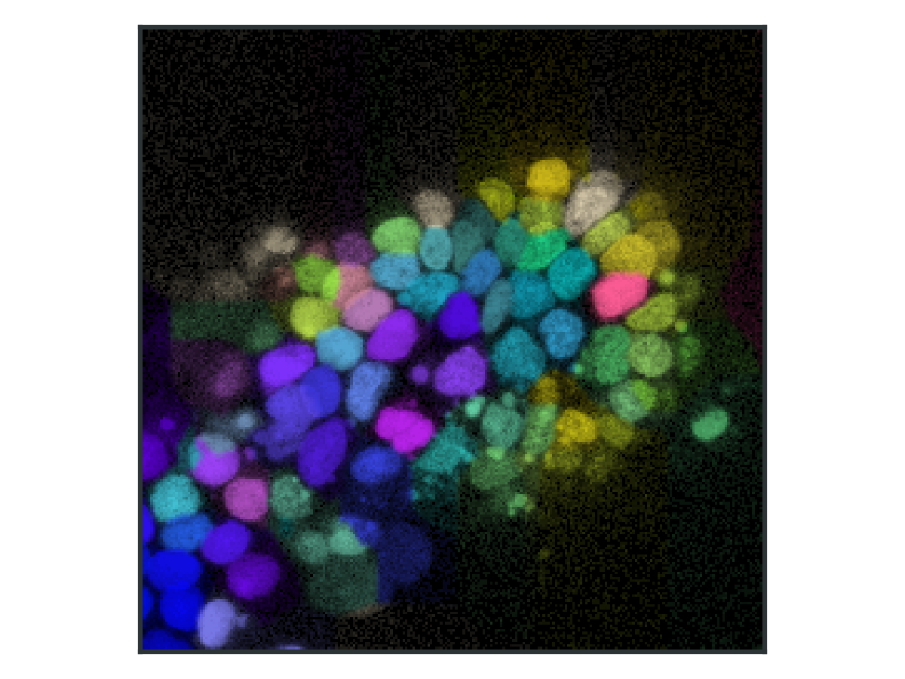

*Work in progress*

# PoseToTypeTracker

Scripts and [OrganoidTracker](https://github.com/jvzonlab/OrganoidTracker) plugins to predict cell types based on nucleus shape.


*Nuclei colored by cell types predicted based on the nucleus shape*

## Intended workflow for training:
1. Obtain a set of organoids with fluorescent nuclei where you figure out the cell types, for example using antibody staining.
2. Load those images in OrganoidTracker, and annotate the nuclei with their cell type.
3. Run CellPose on the nucleus images. This can be done using the provided OrganoidTracker plugin.
4. Measure the features of the nuclei, also done using a provided plugin.
5. Run the provided script to train a logistic regression network.

## Intended workflow for inference of cell type:
1. Take time lapses of fluorescent nuclei.
2. Do tracking of the cells.
3. Run CellPose on the nucleus images. This can be done using the provided OrganoidTracker plugin.
4. Measure the features of the nuclei, also done using a provided plugin.
5. Use the logistic regression model to predict the cell types over time.

# Installation
1. Install OrganoidTracker as usual.
2. Install CellPose into your OrganoidTracker environment:  
   ``` 
   conda install -c conda-forge -c pytorch-lts cellpose pytorch=1.8.2 cudatoolkit=10.2
   ```
3. Copy the files and folders in the `OrganoidTracker plugins` folder into the plugin folder of OrganoidTracker. You can find this folder through the `File` menu of OrganoidTracker.